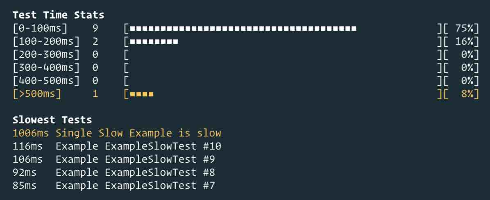

# karma-time-stats-reporter

[](https://circleci.com/gh/crcatala/karma-time-stats-reporter)

## Description

A Karma Reporter for test times stats. See histogram of time your tests take, and identify slow tests.



## Use In Project

Install package:

`npm install karma-time-stats-reporter --save-dev`

in your karma config:

```js
module.exports = function(config) {
  // other keys ommited for brevity
  config.set({
    plugins: ['karma-time-stats-reporter'],
    reporters: ["dots", "time-stats"],
    // This is config options for the reporter. Listed here are the defaults if you don't provide this any options
    timeStatsReporter: {
      reportTimeStats: true,           // Print Time Stats (histogram)
      
      binSize: 100,                    // Bin size for histogram (in milliseconds)

      slowThreshold: 500,              // The threshold for what is considered a slow test (in milliseconds).
                                       // This is also the max value for last bin histogram 
                                       // Note that this will automatically be rounded up to be evenly divisible by binSize

      reportSlowestTests: true,        // Print top slowest tests

      showSlowTestRankNumber: false    // Displays rank number next to slow tests, e.g. `1) Slow Test`

      longestTestsCount: 5,            // Number of top slowest tests to list
                                       // Set to `Infinity` to show all slow tests. Useful in combination with `reportOnlyBeyondThreshold` as `true`

      reportOnlyBeyondThreshold: false // Only report tests that are slower than threshold

    }
  });
};
```
